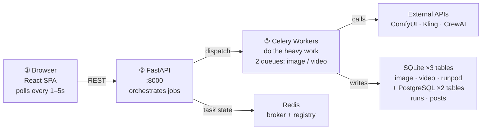
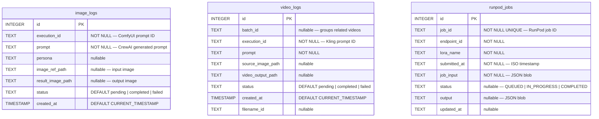
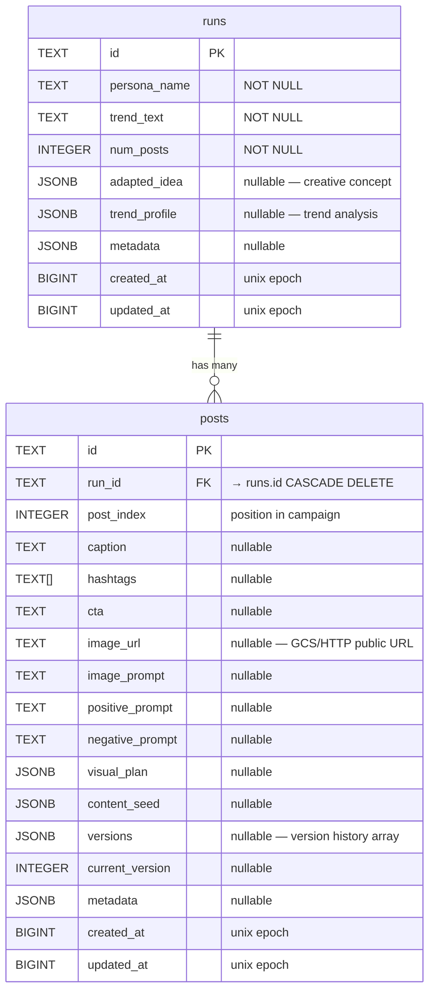
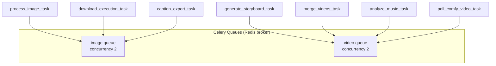
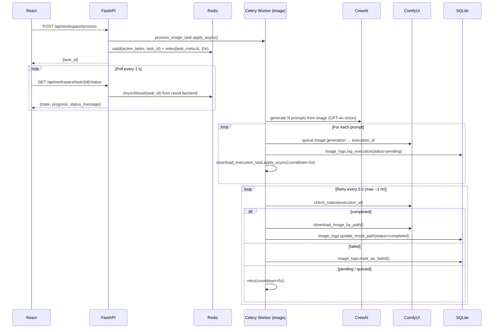
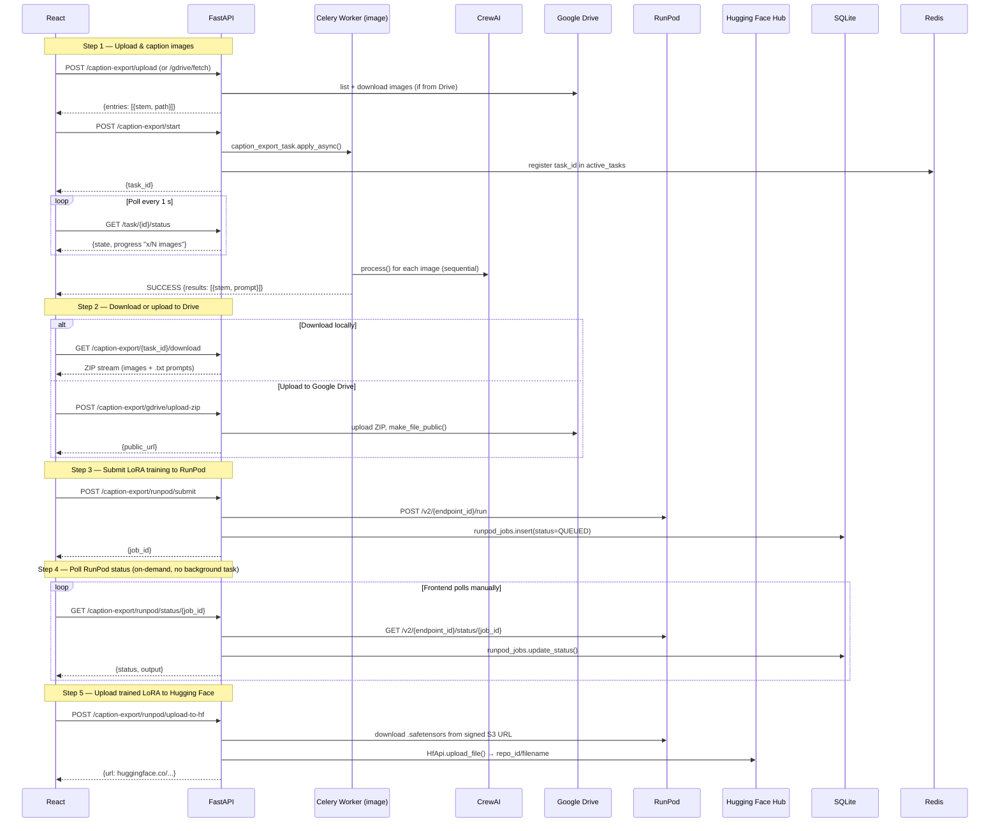
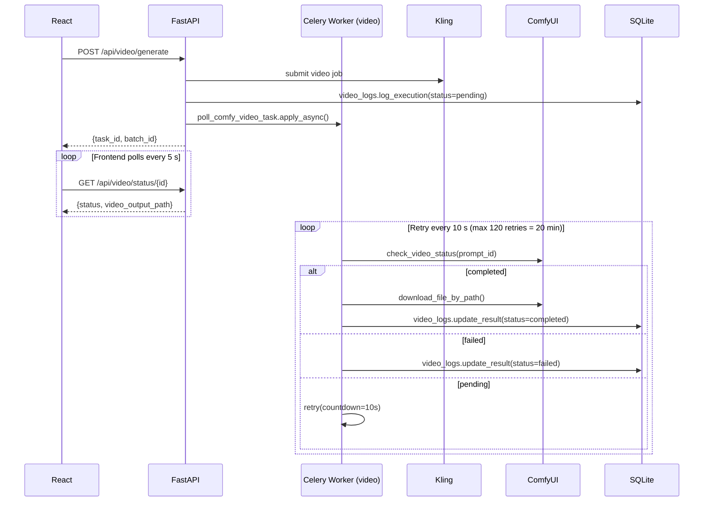
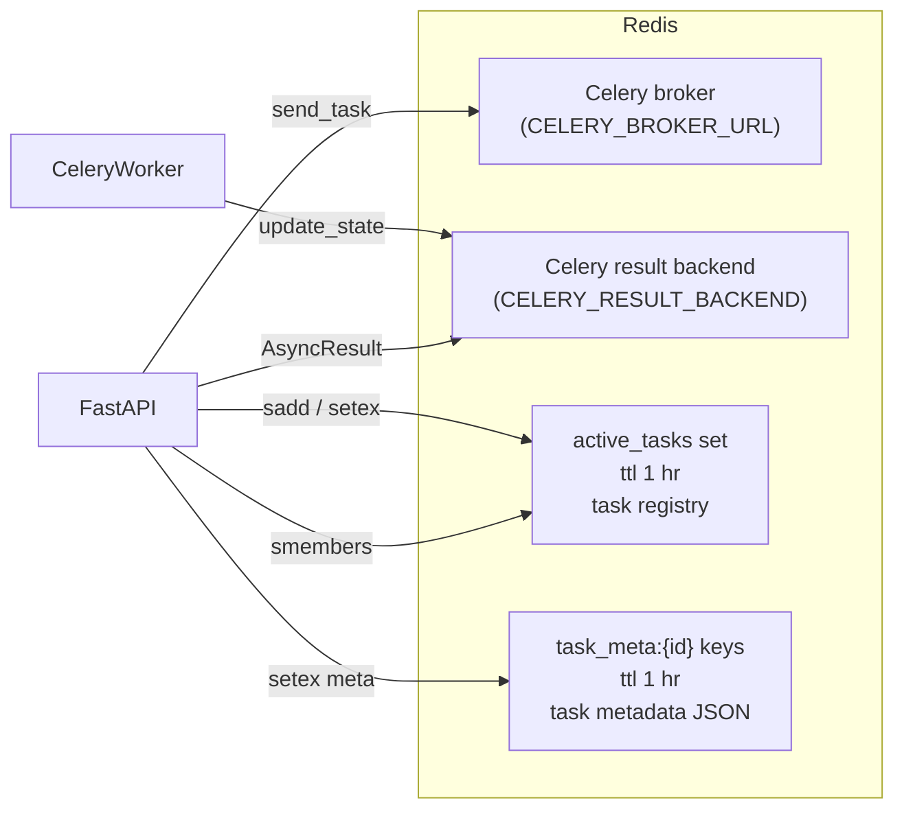
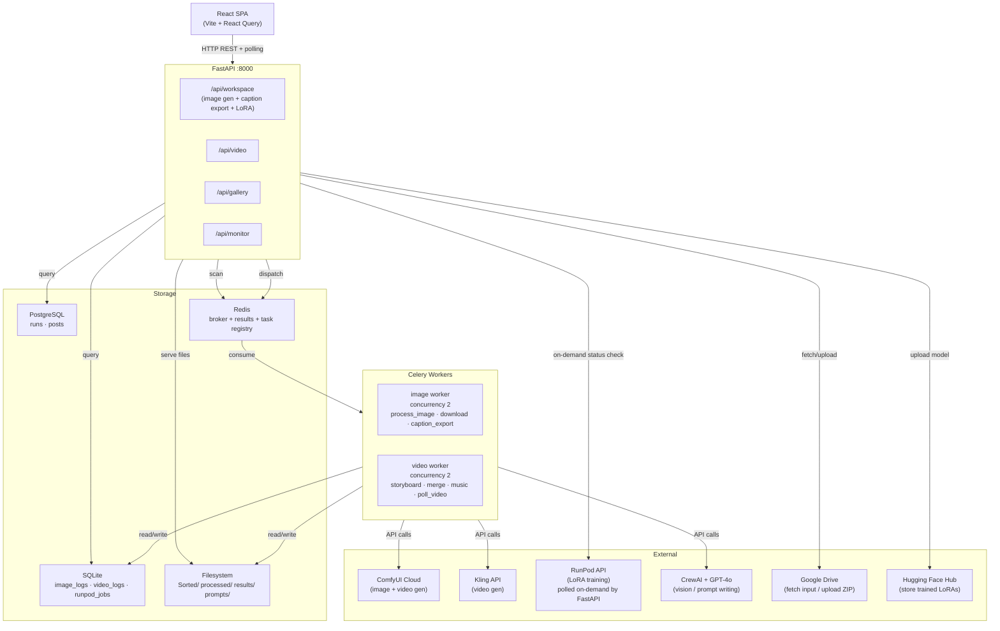

# Architecture: Database Schema & Async Patterns

> Generated 2026-05-11

---

## TL;DR — Executive Summary

**What this system does:** A React + FastAPI app that takes input images, generates AI variations via ComfyUI, curates results in a gallery, and trains custom LoRA models on RunPod.

**Three moving parts:**



**Two main async flows:**

**Flow A — Image generation:**

1. User clicks **Process** → FastAPI enqueues a Celery task, returns a `task_id`
2. React polls `/task/{id}/status` every **1 second** until done
3. Celery worker calls **CrewAI** to write N prompts from the image, sends each to **ComfyUI**
4. A second Celery task retries every **5 s** (up to 1 hr) waiting for ComfyUI, then downloads the result
5. Result path saved to **SQLite** → Gallery reads it

**Flow B — LoRA training:**

1. User uploads images → React calls caption-export → Celery runs **CrewAI** on each image, returns `.txt` prompts
2. User downloads ZIP (images + captions) or uploads directly to **Google Drive**
3. User submits LoRA training job to **RunPod** → job ID saved to SQLite
4. React polls `/runpod/status/{job_id}` — **FastAPI calls RunPod API on-demand** (no background task), updates DB
5. When complete, user triggers upload of the `.safetensors` to **Hugging Face Hub**

**Data stored:** 3 SQLite tables (`image_logs`, `video_logs`, `runpod_jobs`) + 2 PostgreSQL tables (`runs`, `posts` for campaign content). No ORM, no migrations framework — raw SQL.

**No magic:** polling everywhere — no event bus, no persistent WebSocket in practice. Simple and debuggable.

---

## 1. Database Schema

### SQLite — 3 tables (image/video pipeline)



### PostgreSQL — 2 tables (campaign content)



---

## 2. Celery Task Architecture

Two named queues, each with concurrency 2.



### Flow A — Image generation (end-to-end)



### Flow B — Caption export + LoRA training

> **Key:** RunPod polling is NOT a Celery task. The frontend calls FastAPI, which hits the RunPod API on-demand and updates the DB. No background worker involved.



### Video pipeline



---

## 3. Redis Usage



---

## 4. Frontend Async Patterns

All server state via **React Query**. WebSocket endpoint exists but is request-reply only (client sends `{task_id}`, server responds once — not a push stream).

```mermaid
flowchart TD
    subgraph Hooks["React Query Hooks"]
        UT["useTaskProgress\nrefetch every 1s\nstops on SUCCESS / FAILURE"]
        UA["useActiveTasks\nrefetch every 5s\nalways on"]
        UV["useVideoStatus\nrefetch every 5s\nstops on completed / failed"]
        UG["useGalleryImages\nno auto-refetch\nmanual invalidate on approve/reject"]
    end

    UT -->|GET /workspace/task/:id/status| API
    UA -->|GET /workspace/active-tasks| API
    UV -->|GET /video/status/:id| API
    UG -->|GET /gallery/images| API

    subgraph API["FastAPI"]
        API -->|AsyncResult| Redis
        API -->|smembers| Redis
        API -->|SELECT| SQLite
        API -->|GET status on-demand| RunPod
    end
```

---

## 5. Full System Overview



---

## 6. Polling Timeouts Reference

| Service | Poll Interval | Max Duration | Mechanism |
|---------|-------------|--------------|-----------|
| ComfyUI image | 5 s | ~1 hour | Celery retry (worker-side) |
| ComfyUI/Kling video | 10 s | 20 min (120 retries) | Celery retry (worker-side) |
| RunPod LoRA training | on-demand | no timeout | FastAPI → RunPod API (frontend-triggered) |
| Frontend — image/caption task | 1 s | until SUCCESS/FAILURE | React Query refetchInterval |
| Frontend — video task | 5 s | until completed/failed | React Query refetchInterval |
| Frontend — active tasks list | 5 s | always | React Query refetchInterval |
