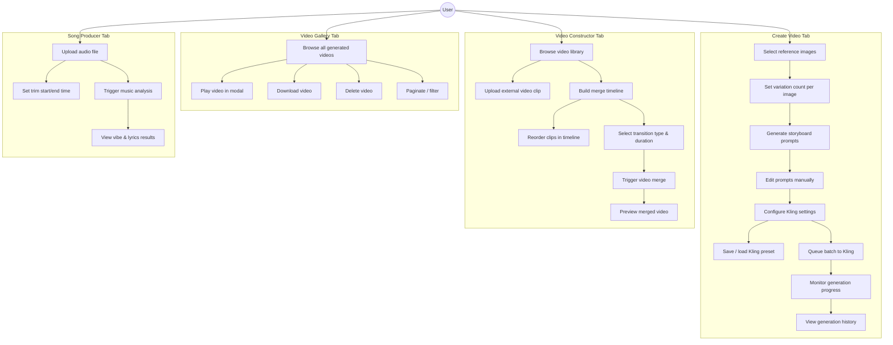
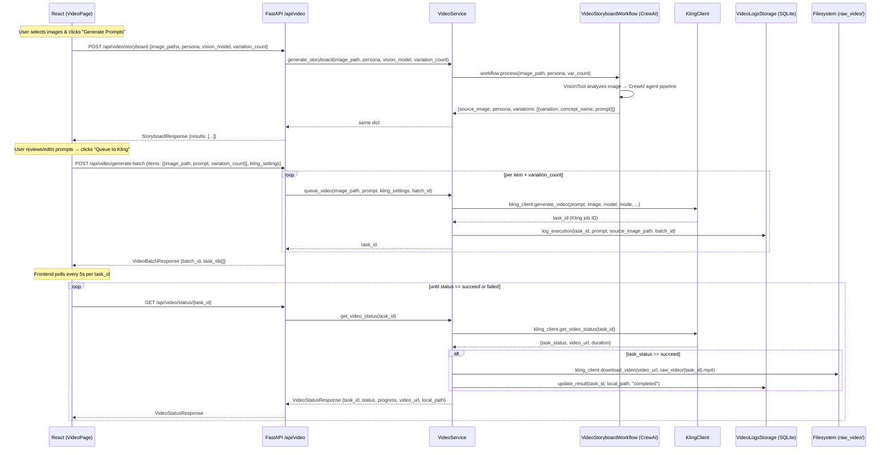
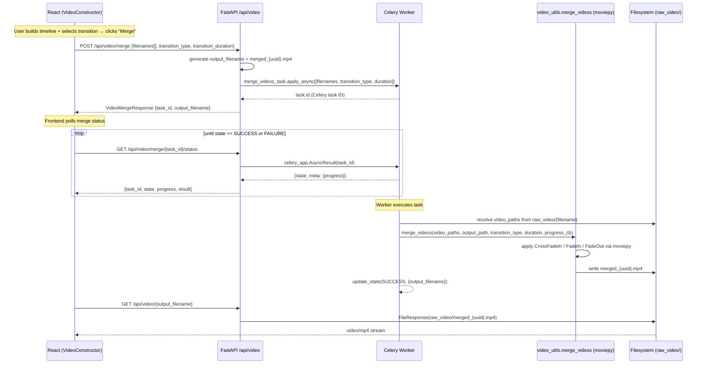
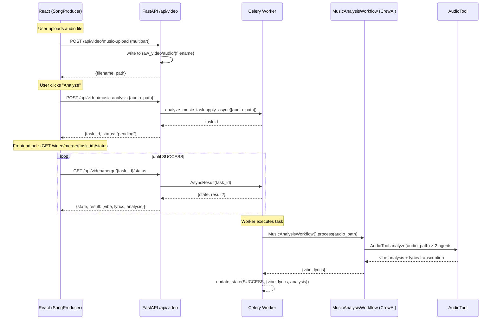

# Video Pipeline — Progress Documentation, Diagrams & Test Plan

**Date:** April 1, 2026  
**Scope:** Video App migration (Phase 3 of ff-auto migration plan)

---

## 1. Implementation Progress

### 1.1 Backend

| File | Status | Description |
|------|--------|-------------|
| `backend/models/video.py` | DONE | Pydantic schemas for all video request/response types |
| `backend/services/video.py` | DONE | `VideoService` — all business logic extracted from Streamlit |
| `backend/api/video.py` | DONE | 14 FastAPI endpoints under `/api/video/` |
| `backend/tasks.py` | DONE | Added `merge_videos_task` and `analyze_music_task` Celery tasks |
| `backend/main.py` | DONE | Video router registered at `/api/video` |
| `backend/api/deps.py` | DONE | `get_video_service()` singleton via `lru_cache` |
| `backend/config.py` | DONE | Added `VIDEO_DIR = os.getenv("VIDEO_DIR", "raw_video")` |

### 1.2 Frontend

| File | Status | Description |
|------|--------|-------------|
| `frontend/src/types/video.ts` | DONE | TypeScript interfaces matching Pydantic models |
| `frontend/src/api/video.ts` | DONE | `videoApi` — typed wrappers for all endpoints |
| `frontend/src/hooks/useStoryboard.ts` | DONE | Mutation hook for prompt generation |
| `frontend/src/hooks/useVideoGenerate.ts` | DONE | `useVideoGenerate` + `useVideoBatchGenerate` mutations |
| `frontend/src/hooks/useVideoStatus.ts` | DONE | Polling query — auto-stops when status is `succeed`/`failed` |
| `frontend/src/hooks/useVideoLibrary.ts` | DONE | `useVideoList` (paginated) + `useKlingPresets` (CRUD) |
| `frontend/src/components/video/KlingSettingsPanel.tsx` | DONE | Full Kling param form |
| `frontend/src/components/video/KlingPresetManager.tsx` | DONE | Save/load/delete named presets |
| `frontend/src/components/video/ImageSelector.tsx` | DONE | Ref image grid with checkmark overlay |
| `frontend/src/components/video/SelectionQueue.tsx` | DONE | Editable queue with prompt + variation count |
| `frontend/src/components/video/StoryboardGenerator.tsx` | DONE | Vision model selector + editable generated prompts |
| `frontend/src/components/video/BatchQueuePanel.tsx` | DONE | Triggers batch, per-task polling progress cards |
| `frontend/src/components/video/VideoGenerationHistory.tsx` | DONE | Table of DB records with status badges |
| `frontend/src/components/video/VideoPreview.tsx` | DONE | `<video>` player with graceful empty state |
| `frontend/src/components/video/VideoCard.tsx` | DONE | Thumbnail card with status badge + delete |
| `frontend/src/components/video/VideoPlayerModal.tsx` | DONE | Full-screen modal with metadata |
| `frontend/src/components/video/VideoLibrary.tsx` | DONE | Paginated grid with upload button |
| `frontend/src/components/video/TimelineEditor.tsx` | DONE | Up/Down/Remove clip ordering |
| `frontend/src/components/video/MergeControls.tsx` | DONE | Transition picker + merge + progress polling |
| `frontend/src/components/video/AudioUploader.tsx` | DONE | Audio file picker + analysis trigger |
| `frontend/src/components/video/AudioTrimmer.tsx` | DONE | Start/end time UI (server-side integration future) |
| `frontend/src/components/video/MusicAnalysisResults.tsx` | DONE | Polls task result, renders vibe/lyrics cards |
| `frontend/src/components/video/VideoGallery.tsx` | DONE | Wrapper over VideoLibrary |
| `frontend/src/pages/VideoPage.tsx` | DONE | 4-tab page: Create Video, Video Constructor, Gallery, Song Producer |
| `frontend/src/App.tsx` | DONE | Added `/video` route |
| `frontend/src/components/shared/Layout.tsx` | DONE | Removed `disabled` flag from Video nav link |

### 1.3 What remains (known gaps)

| Item | Priority | Notes |
|------|----------|-------|
| `docker-compose.yml` — mount `raw_video/` volume | High | Must add to both `backend` and `worker` services |
| `nginx.conf` — `client_max_body_size 500m` | High | Video uploads can be 50-200 MB |
| Audio trimming server-side | Low | `AudioTrimmer` UI exists; actual trim logic not wired |
| GCS video/audio upload | Medium | `gcs_client.py` is available, endpoint not yet exposed |
| Social media CSV export | Low | `export_utils.py` migration deferred |
| `docker-compose.yml` `VIDEO_DIR` env var | High | Add `VIDEO_DIR=/app/raw_video` to backend + worker |

---

## 2. Use Case Diagram



---

## 3. Technical Flow Diagrams

### 3.1 Storyboard + Video Generation Flow



### 3.2 Video Merge Flow



### 3.3 Music Analysis Flow



### 3.4 Component Architecture

```mermaid
graph TB
    subgraph "VideoPage (4 tabs)"
        TAB1[Create Video Tab]
        TAB2[Video Constructor Tab]
        TAB3[Video Gallery Tab]
        TAB4[Song Producer Tab]
    end

    subgraph "Create Video Tab Components"
        IS[ImageSelector]
        SQ[SelectionQueue]
        SBG[StoryboardGenerator]
        KSP[KlingSettingsPanel]
        KPM[KlingPresetManager]
        BQP[BatchQueuePanel]
        VGH[VideoGenerationHistory]
    end

    subgraph "Constructor Tab Components"
        VL[VideoLibrary]
        TE[TimelineEditor]
        MC[MergeControls]
        VP[VideoPreview]
    end

    subgraph "Gallery Tab Components"
        VG[VideoGallery]
        VC[VideoCard]
        VPM[VideoPlayerModal]
    end

    subgraph "Song Producer Components"
        AU[AudioUploader]
        ATR[AudioTrimmer]
        MAR[MusicAnalysisResults]
    end

    subgraph "React Query Hooks"
        H1[useStoryboard]
        H2[useVideoGenerate / useVideoBatchGenerate]
        H3[useVideoStatus polling]
        H4[useVideoList]
        H5[useKlingPresets]
    end

    subgraph "API Layer"
        VAPI[videoApi — /api/video/*]
        WAPI[workspaceApi — /api/workspace/ref-images]
    end

    TAB1 --> IS & SQ & SBG & KSP & KPM & BQP & VGH
    TAB2 --> VL & TE & MC & VP
    TAB3 --> VG --> VC & VPM
    TAB4 --> AU & ATR & MAR

    IS --> WAPI
    SBG --> H1 --> VAPI
    BQP --> H2 --> VAPI
    BQP --> H3 --> VAPI
    VL --> H4 --> VAPI
    VGH --> H4
    KPM --> H5 --> VAPI
    MC --> VAPI
    MAR --> VAPI
    AU --> VAPI
```



---

## 4. API Endpoint Reference

| Method | Endpoint | Req Body | Response | Description |
|--------|----------|----------|----------|-------------|
| POST | `/api/video/storyboard` | `StoryboardRequest` | `StoryboardResponse` | Run CrewAI storyboard workflow |
| POST | `/api/video/generate` | `VideoGenerateRequest` | `VideoGenerateResponse` | Queue single Kling video |
| POST | `/api/video/generate-batch` | `VideoBatchRequest` | `VideoBatchResponse` | Queue batch of videos |
| GET | `/api/video/status/{task_id}` | — | `VideoStatusResponse` | Poll Kling task status |
| GET | `/api/video/list` | — | `VideoListResponse` | Paginated DB listing |
| GET | `/api/video/{filename}` | — | `video/mp4` | Stream/download video |
| GET | `/api/video/{filename}/thumbnail` | — | `image/jpeg` | First-frame thumbnail |
| POST | `/api/video/merge` | `VideoMergeRequest` | `VideoMergeResponse` | Merge videos (Celery async) |
| GET | `/api/video/merge/{task_id}/status` | — | `{state, progress}` | Poll merge task |
| POST | `/api/video/upload` | `multipart/form-data` | `{filename, size_bytes}` | Upload external clip |
| DELETE | `/api/video/{filename}` | — | `{deleted}` | Delete video file |
| POST | `/api/video/music-analysis` | `MusicAnalysisRequest` | `{task_id}` | Analyze audio (Celery async) |
| GET | `/api/video/kling-presets` | — | `KlingPreset[]` | List saved presets |
| POST | `/api/video/kling-presets` | `KlingPreset` | `KlingPreset` | Save/overwrite preset |
| DELETE | `/api/video/kling-presets/{name}` | — | `{deleted}` | Delete preset |

---

## 5. Test Cases

### 5.1 Backend Unit Tests

#### `test_video_models.py`

```python
# TC-M01: KlingSettings default values
def test_kling_settings_defaults():
    s = KlingSettings()
    assert s.model_name == "kling-v1.6"
    assert s.mode == "std"
    assert s.duration == "5"
    assert s.aspect_ratio == "16:9"
    assert s.cfg_scale == 0.5

# TC-M02: cfg_scale validation — rejects out-of-range values
def test_kling_settings_cfg_scale_validation():
    with pytest.raises(ValidationError):
        KlingSettings(cfg_scale=1.5)
    with pytest.raises(ValidationError):
        KlingSettings(cfg_scale=-0.1)

# TC-M03: StoryboardVariation round-trips through JSON
def test_storyboard_variation_json():
    v = StoryboardVariation(variation=1, concept_name="Sunrise walk", prompt="A woman walking...")
    data = v.model_dump()
    v2 = StoryboardVariation(**data)
    assert v2.prompt == v.prompt

# TC-M04: VideoBatchItem variation_count bounds
def test_batch_item_variation_count():
    with pytest.raises(ValidationError):
        VideoBatchItem(image_path="x.png", variation_count=6)
    with pytest.raises(ValidationError):
        VideoBatchItem(image_path="x.png", variation_count=0)
```

#### `test_video_service.py`

```python
# TC-S01: queue_video calls KlingClient.generate_video with correct params
def test_queue_video_calls_kling(monkeypatch, tmp_path):
    svc = make_video_service(tmp_path)
    mock_kling = MagicMock()
    mock_kling.generate_video.return_value = "kling-task-abc"
    svc.kling_client = mock_kling

    settings = KlingSettings(model_name="kling-v2.0", duration="10")
    task_id = svc.queue_video("img.png", "A sunset", settings, batch_id="b1")

    mock_kling.generate_video.assert_called_once()
    call_kwargs = mock_kling.generate_video.call_args[1]
    assert call_kwargs["model_name"] == "kling-v2.0"
    assert call_kwargs["duration"] == "10"
    assert task_id == "kling-task-abc"

# TC-S02: queue_video logs execution to DB
def test_queue_video_logs_to_db(monkeypatch, tmp_path):
    svc = make_video_service(tmp_path)
    svc.kling_client.generate_video = MagicMock(return_value="task-123")

    svc.queue_video("img.png", "Prompt text", KlingSettings())
    record = svc.storage.get_execution("task-123")
    assert record is not None
    assert record["status"] == "pending"
    assert record["prompt"] == "Prompt text"

# TC-S03: get_video_status maps "succeed" → "completed" and triggers download
def test_get_video_status_succeed_downloads(monkeypatch, tmp_path):
    svc = make_video_service(tmp_path)
    svc.kling_client.get_video_status = MagicMock(return_value={
        "task_status": "succeed",
        "video_url": "https://cdn.kling.ai/video/abc.mp4",
        "duration": "5.0"
    })
    downloaded = []
    svc.kling_client.download_video = lambda url, path: downloaded.append(path) or open(path, 'wb').close()

    resp = svc.get_video_status("task-123")

    assert resp.status == "completed"
    assert resp.progress == 100
    assert len(downloaded) == 1

# TC-S04: get_video_status maps "submitted" → "pending" with progress 0
def test_get_video_status_submitted(monkeypatch, tmp_path):
    svc = make_video_service(tmp_path)
    svc.kling_client.get_video_status = MagicMock(return_value={"task_status": "submitted"})

    resp = svc.get_video_status("task-xyz")
    assert resp.status == "pending"
    assert resp.progress == 0

# TC-S05: get_video_status handles Kling API exception gracefully
def test_get_video_status_kling_error(monkeypatch, tmp_path):
    svc = make_video_service(tmp_path)
    svc.kling_client.get_video_status = MagicMock(side_effect=Exception("API down"))

    resp = svc.get_video_status("task-err")
    assert resp.status == "error"

# TC-S06: list_videos returns correct pagination
def test_list_videos_pagination(tmp_path):
    svc = make_video_service(tmp_path)
    # Seed 25 records
    for i in range(25):
        svc.storage.log_execution(f"task-{i}", f"prompt {i}", "img.png")

    result = svc.list_videos(page=1, per_page=10)
    assert result["total"] == 25
    assert result["pages"] == 3
    assert len(result["items"]) == 10

    result2 = svc.list_videos(page=3, per_page=10)
    assert len(result2["items"]) == 5

# TC-S07: get_video_thumbnail returns None for missing file
def test_get_video_thumbnail_missing(tmp_path):
    svc = make_video_service(tmp_path)
    result = svc.get_video_thumbnail("nonexistent.mp4")
    assert result is None

# TC-S08: save_preset / list_presets / delete_preset round-trip
def test_preset_crud(tmp_path):
    svc = make_video_service(tmp_path)
    settings = KlingSettings(model_name="kling-v2.6", duration="10")

    svc.save_preset("my-preset", settings)
    presets = svc.list_presets()
    assert any(p["name"] == "my-preset" for p in presets)

    deleted = svc.delete_preset("my-preset")
    assert deleted is True
    assert not any(p["name"] == "my-preset" for p in svc.list_presets())

# TC-S09: delete_preset returns False for unknown name
def test_delete_preset_not_found(tmp_path):
    svc = make_video_service(tmp_path)
    assert svc.delete_preset("ghost-preset") is False

# TC-S10: merge_videos_sync raises FileNotFoundError for missing clip
def test_merge_videos_missing_file(tmp_path):
    svc = make_video_service(tmp_path)
    with pytest.raises(FileNotFoundError):
        svc.merge_videos_sync(["nonexistent_a.mp4", "nonexistent_b.mp4"])
```

#### `test_video_api.py` (FastAPI TestClient)

```python
# TC-A01: POST /generate returns 200 with task_id
def test_generate_returns_task_id(client, mock_video_service):
    mock_video_service.queue_video.return_value = "kling-task-001"
    resp = client.post("/api/video/generate", json={
        "image_path": "processed/ref_img.png",
        "prompt": "She walks on the beach",
        "kling_settings": {"model_name": "kling-v1.6", "mode": "std", "duration": "5",
                           "aspect_ratio": "16:9", "cfg_scale": 0.5}
    })
    assert resp.status_code == 200
    assert resp.json()["task_id"] == "kling-task-001"

# TC-A02: POST /generate returns 500 when KlingClient raises
def test_generate_kling_error(client, mock_video_service):
    mock_video_service.queue_video.side_effect = Exception("Kling quota exceeded")
    resp = client.post("/api/video/generate", json={
        "image_path": "img.png",
        "kling_settings": {"model_name": "kling-v1.6", "mode": "std", "duration": "5",
                           "aspect_ratio": "16:9", "cfg_scale": 0.5}
    })
    assert resp.status_code == 500
    assert "Kling quota exceeded" in resp.json()["detail"]

# TC-A03: POST /generate-batch creates correct batch_id and task_ids count
def test_generate_batch(client, mock_video_service):
    mock_video_service.queue_video.side_effect = ["t1", "t2", "t3"]
    resp = client.post("/api/video/generate-batch", json={
        "items": [
            {"image_path": "a.png", "prompt": "A", "variation_count": 2},
            {"image_path": "b.png", "prompt": "B", "variation_count": 1},
        ],
        "kling_settings": {"model_name": "kling-v1.6", "mode": "std", "duration": "5",
                           "aspect_ratio": "16:9", "cfg_scale": 0.5}
    })
    assert resp.status_code == 200
    data = resp.json()
    assert len(data["task_ids"]) == 3
    assert data["batch_id"] is not None

# TC-A04: GET /status/{task_id} returns VideoStatusResponse
def test_status_endpoint(client, mock_video_service):
    mock_video_service.get_video_status.return_value = VideoStatusResponse(
        task_id="t1", status="processing", progress=50
    )
    resp = client.get("/api/video/status/t1")
    assert resp.status_code == 200
    assert resp.json()["status"] == "processing"
    assert resp.json()["progress"] == 50

# TC-A05: GET /list returns paginated VideoListResponse
def test_list_endpoint(client, mock_video_service):
    mock_video_service.list_videos.return_value = {
        "items": [], "total": 0, "page": 1, "pages": 1
    }
    resp = client.get("/api/video/list?page=1&per_page=10")
    assert resp.status_code == 200
    assert "items" in resp.json()

# TC-A06: GET /{filename}/thumbnail returns 404 when not available
def test_thumbnail_404(client, mock_video_service):
    mock_video_service.get_video_thumbnail.return_value = None
    resp = client.get("/api/video/my_video.mp4/thumbnail")
    assert resp.status_code == 404

# TC-A07: GET /{filename}/thumbnail returns JPEG when available
def test_thumbnail_200(client, mock_video_service):
    mock_video_service.get_video_thumbnail.return_value = b"fake-jpeg-bytes"
    resp = client.get("/api/video/my_video.mp4/thumbnail")
    assert resp.status_code == 200
    assert resp.headers["content-type"] == "image/jpeg"

# TC-A08: GET /{filename} returns 404 when file missing
def test_stream_video_404(client, tmp_video_dir):
    resp = client.get("/api/video/nonexistent.mp4")
    assert resp.status_code == 404

# TC-A09: DELETE /{filename} returns 404 for nonexistent file
def test_delete_video_404(client, tmp_video_dir):
    resp = client.delete("/api/video/ghost.mp4")
    assert resp.status_code == 404

# TC-A10: DELETE /{filename} deletes file and returns 200
def test_delete_video_success(client, tmp_video_dir):
    # Create a dummy file
    (tmp_video_dir / "delete_me.mp4").write_bytes(b"fake")
    resp = client.delete("/api/video/delete_me.mp4")
    assert resp.status_code == 200
    assert not (tmp_video_dir / "delete_me.mp4").exists()

# TC-A11: POST /storyboard returns StoryboardResponse shape
def test_storyboard_endpoint(client, mock_video_service):
    mock_video_service.generate_storyboard.return_value = {
        "source_image": "img.png",
        "persona": "jennie",
        "variations": [{"variation": 1, "concept_name": "Walk", "prompt": "She walks..."}]
    }
    resp = client.post("/api/video/storyboard", json={
        "image_paths": ["img.png"],
        "persona": "jennie",
        "vision_model": "gpt-4o",
        "variation_count": 1
    })
    assert resp.status_code == 200
    assert len(resp.json()["results"]) == 1

# TC-A12: POST /merge dispatches Celery task
def test_merge_dispatches_celery(client, monkeypatch):
    mock_task = MagicMock()
    mock_task.id = "celery-merge-123"
    monkeypatch.setattr("backend.tasks.merge_videos_task.apply_async", lambda args: mock_task)

    resp = client.post("/api/video/merge", json={
        "filenames": ["a.mp4", "b.mp4"],
        "transition_type": "Crossfade",
        "transition_duration": 0.5
    })
    assert resp.status_code == 200
    assert resp.json()["task_id"] == "celery-merge-123"

# TC-A13: GET /kling-presets returns empty list when no presets exist
def test_kling_presets_empty(client, mock_video_service):
    mock_video_service.list_presets.return_value = []
    resp = client.get("/api/video/kling-presets")
    assert resp.status_code == 200
    assert resp.json() == []

# TC-A14: DELETE /kling-presets/{name} returns 404 for unknown preset
def test_delete_preset_404(client, mock_video_service):
    mock_video_service.delete_preset.return_value = False
    resp = client.delete("/api/video/kling-presets/ghost")
    assert resp.status_code == 404

# TC-A15: POST /upload saves file and returns filename
def test_upload_video(client, tmp_video_dir):
    resp = client.post(
        "/api/video/upload",
        files={"file": ("test.mp4", b"fake-mp4-content", "video/mp4")}
    )
    assert resp.status_code == 200
    assert resp.json()["filename"] == "test.mp4"
    assert (tmp_video_dir / "test.mp4").exists()
```

### 5.2 Celery Task Tests

```python
# TC-T01: merge_videos_task calls video_utils.merge_videos with resolved paths
def test_merge_task_resolves_paths(monkeypatch, tmp_path):
    monkeypatch.setenv("VIDEO_DIR", str(tmp_path))
    # Create dummy video files
    (tmp_path / "a.mp4").write_bytes(b"")
    (tmp_path / "b.mp4").write_bytes(b"")

    calls = []
    monkeypatch.setattr(
        "backend.utils.video_utils.merge_videos",
        lambda paths, out, transition, duration, cb=None: calls.append((paths, out))
    )
    merge_videos_task.apply(args=[["a.mp4", "b.mp4"], "Crossfade", 0.5])
    assert len(calls) == 1
    assert calls[0][0] == [str(tmp_path / "a.mp4"), str(tmp_path / "b.mp4")]

# TC-T02: analyze_music_task returns vibe and lyrics keys
def test_analyze_music_task(monkeypatch):
    monkeypatch.setattr(
        "backend.workflows.music_analysis_workflow.MusicAnalysisWorkflow.process",
        lambda self, audio_path: {"vibe": "chill", "lyrics": "la la la"}
    )
    result = analyze_music_task.apply(args=["audio.mp3"]).get()
    assert result["vibe"] == "chill"
    assert result["lyrics"] == "la la la"
```

### 5.3 Frontend Hook Tests

```typescript
// TC-H01: useVideoStatus polls every 5s and stops on succeed
describe('useVideoStatus', () => {
  it('stops polling when status is succeed', async () => {
    server.use(
      rest.get('/api/video/status/task-1', (req, res, ctx) =>
        res(ctx.json({ task_id: 'task-1', status: 'succeed', progress: 100 }))
      )
    )
    const { result } = renderHook(() => useVideoStatus('task-1'))
    await waitFor(() => expect(result.current.data?.status).toBe('succeed'))
    // refetchInterval should return false → no further fetches
  })

  it('continues polling when status is processing', async () => {
    let callCount = 0
    server.use(
      rest.get('/api/video/status/task-2', (req, res, ctx) => {
        callCount++
        return res(ctx.json({ task_id: 'task-2', status: 'processing', progress: 50 }))
      })
    )
    const { result } = renderHook(() => useVideoStatus('task-2'))
    await waitFor(() => expect(callCount).toBeGreaterThan(1))
  })

  it('is disabled when taskId is null', () => {
    const { result } = renderHook(() => useVideoStatus(null))
    expect(result.current.fetchStatus).toBe('idle')
  })
})

// TC-H02: useKlingPresets.save invalidates presets query
describe('useKlingPresets', () => {
  it('invalidates presets after save', async () => {
    const qc = new QueryClient()
    const { result } = renderHook(() => useKlingPresets(), { wrapper: makeWrapper(qc) })
    await result.current.save.mutateAsync({
      name: 'test', settings: defaultKlingSettings
    })
    // Query should be refetched
    expect(qc.getQueryState(['klingPresets'])?.isInvalidated).toBe(true)
  })
})
```

### 5.4 Frontend Component Tests

```typescript
// TC-C01: KlingSettingsPanel renders sound toggle only for kling-v2.6
describe('KlingSettingsPanel', () => {
  it('hides sound toggle for kling-v1.6', () => {
    render(<KlingSettingsPanel value={defaultSettings} onChange={jest.fn()} />)
    expect(screen.queryByLabelText(/sound generation/i)).not.toBeInTheDocument()
  })

  it('shows sound toggle for kling-v2.6', () => {
    render(<KlingSettingsPanel value={{...defaultSettings, model_name: 'kling-v2.6'}} onChange={jest.fn()} />)
    expect(screen.getByLabelText(/sound generation/i)).toBeInTheDocument()
  })
})

// TC-C02: ImageSelector shows checkmark on selected image
describe('ImageSelector', () => {
  it('renders check overlay on selected image', async () => {
    server.use(
      rest.get('/api/workspace/ref-images', (req, res, ctx) =>
        res(ctx.json([{ filename: 'img1.png', path: 'processed/img1.png', ... }]))
      )
    )
    render(<ImageSelector selected={['processed/img1.png']} onToggle={jest.fn()} />)
    await waitFor(() => expect(screen.getByTestId('selected-overlay-img1.png')).toBeInTheDocument())
  })
})

// TC-C03: BatchQueuePanel shows task cards after queuing
describe('BatchQueuePanel', () => {
  it('shows progress card per task after queue', async () => {
    server.use(
      rest.post('/api/video/generate-batch', (req, res, ctx) =>
        res(ctx.json({ batch_id: 'b1', task_ids: ['t1', 't2'] }))
      )
    )
    const items = [{ image_path: 'a.png', prompt: '', variation_count: 2 }]
    render(<BatchQueuePanel items={items} klingSettings={defaultSettings} />)
    fireEvent.click(screen.getByRole('button', { name: /queue to kling/i }))
    await waitFor(() => {
      expect(screen.getAllByTestId('task-progress-card')).toHaveLength(2)
    })
  })
})

// TC-C04: VideoPlayerModal renders video element when video prop is set
describe('VideoPlayerModal', () => {
  it('renders video element with src', () => {
    const video = { execution_id: 't1', filename: 't1.mp4', status: 'completed', ... }
    render(<VideoPlayerModal video={video} onClose={jest.fn()} />)
    const videoEl = screen.getByRole('video')
    expect(videoEl).toHaveAttribute('src', '/api/video/t1.mp4')
  })

  it('renders nothing when video is null', () => {
    const { container } = render(<VideoPlayerModal video={null} onClose={jest.fn()} />)
    expect(container).toBeEmptyDOMElement()
  })
})

// TC-C05: MergeControls disables merge button when no filenames
describe('MergeControls', () => {
  it('disables merge button when filenames is empty', () => {
    render(<MergeControls filenames={[]} onMergeComplete={jest.fn()} />)
    expect(screen.getByRole('button', { name: /merge/i })).toBeDisabled()
  })
})
```

### 5.5 Integration Tests

```python
# TC-I01: Full generate → poll → file-serve flow (mocked Kling)
def test_full_generate_flow(client, tmp_video_dir, monkeypatch):
    # 1. Generate
    monkeypatch.setattr(KlingClient, "generate_video", lambda *a, **kw: "task-full-001")
    resp = client.post("/api/video/generate", json={
        "image_path": "img.png",
        "kling_settings": {...}
    })
    assert resp.json()["task_id"] == "task-full-001"

    # 2. Poll — processing
    monkeypatch.setattr(KlingClient, "get_video_status", lambda *a, **kw: {"task_status": "processing"})
    resp = client.get("/api/video/status/task-full-001")
    assert resp.json()["status"] == "processing"

    # 3. Poll — succeed → triggers download
    fake_video = tmp_video_dir / "task-full-001.mp4"
    def fake_download(url, path): Path(path).write_bytes(b"fake-video")
    monkeypatch.setattr(KlingClient, "download_video", fake_download)
    monkeypatch.setattr(KlingClient, "get_video_status", lambda *a, **kw: {
        "task_status": "succeed", "video_url": "https://cdn.kling.ai/v.mp4", "duration": "5"
    })
    resp = client.get("/api/video/status/task-full-001")
    assert resp.json()["status"] == "completed"
    assert fake_video.exists()

    # 4. Stream video
    resp = client.get("/api/video/task-full-001.mp4")
    assert resp.status_code == 200
    assert resp.headers["content-type"] == "video/mp4"

# TC-I02: Preset round-trip — save, list, load, delete
def test_preset_round_trip(client):
    preset_payload = {"name": "4k-pro", "settings": {"model_name": "kling-v2.0", "mode": "pro",
        "duration": "10", "aspect_ratio": "16:9", "cfg_scale": 0.7}}

    resp = client.post("/api/video/kling-presets", json=preset_payload)
    assert resp.status_code == 200

    resp = client.get("/api/video/kling-presets")
    names = [p["name"] for p in resp.json()]
    assert "4k-pro" in names

    resp = client.delete("/api/video/kling-presets/4k-pro")
    assert resp.status_code == 200

    resp = client.get("/api/video/kling-presets")
    assert "4k-pro" not in [p["name"] for p in resp.json()]
```

### 5.6 Test Coverage Summary

| Area | Test IDs | Coverage Target |
|------|----------|----------------|
| Pydantic models validation | TC-M01 to TC-M04 | 100% validation paths |
| VideoService business logic | TC-S01 to TC-S10 | All public methods |
| FastAPI routes (status codes + shapes) | TC-A01 to TC-A15 | All 14+ endpoints |
| Celery tasks | TC-T01 to TC-T02 | Both video tasks |
| React hooks | TC-H01 to TC-H02 | Polling logic + cache invalidation |
| React components | TC-C01 to TC-C05 | Key interactive behaviors |
| Integration flows | TC-I01 to TC-I02 | Happy path + preset CRUD |

---

## 6. Environment Setup Checklist

Before running tests, ensure:

```bash
# Required env vars
KLING_ACCESS_KEY=<key>
KLING_SECRET_KEY=<secret>
VIDEO_DIR=raw_video           # or absolute path in Docker
OPENAI_API_KEY=<key>          # for vision/LLM in storyboard workflow
CELERY_BROKER_URL=redis://localhost:6379/1
CELERY_RESULT_BACKEND=redis://localhost:6379/2

# Required services
docker compose up redis       # or global-redis
celery -A backend.celery_app worker -B --loglevel=info
uvicorn backend.main:app --reload

# Install test deps
pip install pytest pytest-mock httpx
cd frontend && npm test
```

## 7. Docker Compose Changes Required

Add to both `backend` and `worker` service volumes:
```yaml
- ../raw_video:/app/raw_video
```

Add to both services' environment:
```yaml
- VIDEO_DIR=/app/raw_video
```

Update nginx.conf:
```nginx
client_max_body_size 500m;   # for large video uploads
```
